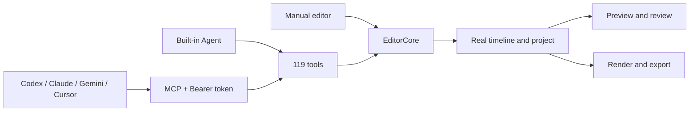

<p align="center">
  
</p>

<h1 align="center">YoloCut</h1>

<p align="center">
  <strong>A local-first desktop video editor for manual precision and Agent-driven production</strong>
</p>

<p align="center">
  Multitrack editing · Detachable Agent workspace · Batch auto-editing · 119 MCP tools · Local models · NVDEC / NVENC
</p>

<p align="center">
  <a href="README_ZH.md">简体中文</a> · <strong>English</strong>
</p>

<p align="center">
  <a href="https://github.com/Hhz0823/YoloCut/releases/tag/v0.0.1"></a>
  
  
  
  <a href="LICENSE"></a>
</p>

<p align="center">
  <a href="https://github.com/Hhz0823/YoloCut/releases/download/v0.0.1/YoloCut-v0.0.1-x64.exe"><strong>Download for Windows</strong></a>
  · <a href="#agent-connection-and-the-complete-editing-flow">Connect an Agent</a>
  · <a href="#run-from-source">Run from source</a>
  · <a href="https://github.com/Hhz0823/YoloCut/issues">Report an issue</a>
</p>

<p align="center">
  
</p>

## What is YoloCut?

YoloCut puts a familiar desktop editing workspace and Agent automation inside the same real project. Edit tracks manually, trim and split clips, grade color, create captions, and mix audio—or let the built-in Agent, Codex, Claude Code, Gemini CLI, Cursor, or another MCP client inspect the project and call the same editing tools.

It is not a one-shot prompt that returns an immutable video. Agent operations become actual tracks, clips, keyframes, captions, transitions, effects, and media. You can preview them, review them, undo them, continue editing by hand, and export a deliverable video or project package.

```text
Media + scripts → Agent builds a reviewable proposal → Real timeline edits
                → Preview / adjust / undo → Captions + mix → Accelerated export
```

## Product workspace

<table>
  <tr>
    <td width="50%">
      
      <br /><sub><b>Local project dashboard</b> — Create, search, import, duplicate, archive, and manage projects.</sub>
    </td>
    <td width="50%">
      
      <br /><sub><b>Agent and timeline collaboration</b> — Generate a proposal in chat, then refine it on real tracks.</sub>
    </td>
  </tr>
  <tr>
    <td width="50%">
      
      <br /><sub><b>Motion graphics</b> — Built-in templates, custom code, and editable MG clips.</sub>
    </td>
    <td width="50%">
      
      <br /><sub><b>Visual effects</b> — WebGL / GLSL effects, masks, grading, LUTs, and transitions.</sub>
    </td>
  </tr>
</table>

The interface uses a restrained dark liquid-glass visual language. The Agent workspace docks on either side, detaches into a wide native window by drag or button, and docks back into the main editor.

## Core capabilities

| Area | Current YoloCut capabilities |
|---|---|
| Timeline | Multitrack editing, move, trim, split, ripple, snapping, keyframes, markers, undo, and redo |
| Canvas and preview | 25%–400% zoom, hand pan, custom dimensions, safe areas, and social composition guides |
| Visuals | Liquid glass, VHS, old film, thermal, night vision, comic, prism, ripple, CRT, chroma key, local mosaic, LUTs, and custom shaders |
| Audio | Multiple tracks, sound effects, music, narration, loudness, ducking, voice isolation, and audio export |
| Transcript and captions | Transcription jobs, word-level editing, silence compression, search, auto-captions, translation, styles, and SRT export |
| Motion graphics | Built-in templates, a constrained runtime sandbox, custom templates, and video materialization |
| Agent | Built-in chat Agent, skills, proposals, approval, progress, history, and external MCP |
| Batch auto-editing | Media folders, edit scripts, narration scripts, reference videos, queueing, isolated projects, QA, and result writeback |
| AI services | Third-party LLMs, ZCode Antigravity, local reference analysis, local/cloud voice, image, video, music, and sound services |
| Delivery | MP4, audio, captions, FCPXML, project packages, export history, hardware-aware H.264, and resource-aware queueing |

## Agent workspace

The Agent workspace is not a chat-only sidebar. It is a control surface for YoloCut:

- Manual editing and Agent editing share the same `EditorCore` commands and project state.
- The workspace detaches into a wide native window and docks back to either side.
- Edits enter reviewable sessions before they are applied, rejected, undone, or revised.
- The built-in Agent and external MCP clients share the current **119-tool canonical catalog**.
- Without an open project, `server-direct` exposes only a limited data layer and never pretends to offer the full editor.



## Agent connection and the complete editing flow

Install the YoloCut Agent Skill:

```bash
npx skills add Hhz0823/YoloCut --skill yolocut
```

Start YoloCut, open the target project, then copy the active URL and Bearer token from **Agent Connection Center (MCP)**. The default endpoint is:

```text
http://localhost:5199/api/external-mcp/mcp
```

The desktop app can select another loopback port when `5199` is busy. External clients should use the URL displayed by the connection center instead of permanently hard-coding the default.

Complete session order:

```text
yolocut_status
  → get_connection_manifest
  → list_projects
  → target_project
  → load_skill / ToolSearch
  → begin_edit_session
  → read and edit tools carrying editSessionId
  → review_edit_session
  → get_edit_session (status=applied)
```

An Agent may report completion only when `readiness.fullEditing=ready`, `capabilityCoverage.complete=true`, and the final session is `applied`. Configuration examples for Codex, Claude Code, Gemini CLI, and Cursor are in the [YoloCut Agent connection guide](YOLOCUT_AGENT_CONNECTION.md).

## ZCode Antigravity and third-party AI

The Windows build can discover a local ZCode Antigravity installation:

- It accepts only `127.0.0.1:18080..18180/v1`, preventing a local key from being sent to a remote relay.
- It checks live `/v1/models` output and requires `gemini-3.7-flash`; stale state never masquerades as a successful connection.
- YoloCut stores only the random local gateway API key. It never reads ZCode OAuth or upstream account credentials.
- Manual local port, API key, and model recovery remains available when discovery fails.

The built-in Agent can also use Anthropic, OpenAI, Gemini, Kimi, Qwen, GLM, DeepSeek, MiniMax, Mistral, and OpenAI-compatible endpoints. Available behavior depends on the provider, model, and credentials the user actually configures. Missing cloud configuration does not disable local timeline editing.

## Batch auto-editing

YoloCut can give an Agent media, an edit script, a narration script, and a reference video as one batch intake. The queue contract accepts up to **10,000 jobs**. Each job owns an isolated project and lifecycle instead of putting thousands of videos on one timeline.

1. Select a local media directory and grant scoped directory access.
2. Supply an edit script, narration script, and optional finished-video reference.
3. Local reference analysis extracts pacing, shot structure, caption, transition, and grading patterns.
4. The Agent claims only the concurrency allowed by the current hardware plan and creates a reviewable proposal.
5. Each job edits, validates, renders, and writes back a succeeded, failed, or cancelled result independently.

The optional open-source reference-analysis pack uses Apache-2.0 `SmolVLM2-500M-Video-Instruct-GGUF` with `llama.cpp`. Missing models or runtimes fail explicitly; YoloCut does not fabricate an analysis. A reference video is used only for structural patterns, not to copy its people, media, trademarks, or protected expression.

## Long 4K media and adaptive hardware policy

YoloCut reads desktop hardware capabilities and applies conservative policies to Agent analysis, preview proxies, rendering, and local voice. Long 4K sources use lower-resolution proxies for analysis and preview while final export still reads the original media.

| Hardware tier | Auto-edit policy | Local narration recommendation |
|---|---|---|
| Unrecognized GPU / low-end system | 540p proxy, one analysis worker, one renderer; use hardware when verified, otherwise software fallback | Kokoro CPU fallback |
| RTX 2060 6 GB | 540p proxy, one analysis worker, one renderer, NVDEC / NVENC preferred | Kokoro 82M ONNX, WebGPU preferred with CPU fallback |
| RTX 4060 8–9 GB | 720p proxy, two analysis workers, one renderer | Fish Audio S2 Pro `s2.cpp + Q6_K` (experimental) |
| RTX 5060+ 8–9 GB | 1080p proxy, up to three analysis workers, one renderer | Fish Audio S2 Pro `s2.cpp + Q6_K` (experimental) |
| RTX 40/50 series with ≥10 GB | Protect one renderer and the VRAM peak | Fish Audio S2 Pro `s2.cpp + Q8_0` (experimental) |

On NVIDIA systems that pass runtime probes, preview proxies support a zero-copy `NVDEC → scale_cuda → NVENC` path. Windows H.264 probes NVENC, QSV, and AMF before falling back to `libx264`. The UI and job results report the actual runtime backend and fallback reason; a GPU name alone is never treated as proof that CUDA is active.

> Fish S2 packs use the Fish Audio Research License and are currently intended for research and non-commercial use. Commercial use requires separate written permission. The `s2.cpp` integration and hardware tiers are experimental; real speed and stability depend on drivers, VRAM, and the installed runtime.

## Download and install

The current public desktop release is [YoloCut v0.0.1](https://github.com/Hhz0823/YoloCut/releases/tag/v0.0.1) for Windows x64.

- Installer: [YoloCut-v0.0.1-x64.exe](https://github.com/Hhz0823/YoloCut/releases/download/v0.0.1/YoloCut-v0.0.1-x64.exe)
- Size: 598,673,209 bytes (570.9 MiB)
- SHA-256: `19AE22AB31D309C2D18DB706E7FD8BA06AD29F56530284DA987C5C475AC73841`
- In-app updates: the Release also contains `latest-x64.yml` and the installer blockmap

The installer passed silent install, application launch, rendering, MCP recovery, update-feed, uninstall, and cleanup checks. It is not Authenticode-signed, so Windows may show a SmartScreen warning. Verify the SHA-256 before running it.

v0.0.1 does not provide macOS or Linux binaries. Run from source on those platforms.

## Run from source

Requires Node.js `>=24 <25` and npm.

```bash
git clone https://github.com/Hhz0823/YoloCut.git
cd yolocut
npm install
cp .env.example .env.local
npm run dev
```

The browser development entry point defaults to:

```text
http://localhost:5199
```

Desktop development and Windows packaging:

```bash
npm run desktop:dev
npm run desktop:dist:win
```

Only configure model or media services that you actually use in `.env.local`. Development launches isolate projects, media, jobs, credentials, and settings by Git checkout/worktree so concurrent branches do not contaminate one another.

## Data, privacy, and security

- Projects, chats, versions, and media indexes stay local by default under `~/.yolocut`; existing legacy roots are mounted automatically on first YoloCut launch.
- User media lives in a configurable local directory that can be backed up or migrated independently.
- Whether an AI request leaves the machine depends on the model, generation provider, or media service you configure.
- Provider credentials are stored by the server and are never exposed to the browser through `VITE_` variables.
- MCP binds to loopback by default; the connection center issues a Bearer token and runs a real connection self-test.
- Agents can modify a project only through `EditorCore`, keeping edits traceable, reviewable, and undoable.
- Templates, plugins, shaders, LLM output, and user input are validated at their trust boundaries.
- Local directory access uses opaque grants; absolute filesystem paths do not cross desktop IPC into Agent payloads.

YoloCut is designed for a single-user desktop workflow. Do not expose it as an unisolated multi-tenant service.

## Architecture

| Layer | Main technology |
|---|---|
| Desktop and frontend | Electron 43, React 19, TypeScript 6, Vite 8 |
| Editing core | Immutable timeline state, command layer, proposals, and atomic undo |
| Agent | Vercel AI SDK 7, Agent Skills, MCP SDK, and the 119-tool catalog |
| Preview and render | Remotion Player, Remotion Renderer, and FFmpeg |
| Visual runtime | WebGL / GLSL, LUTs, and a constrained motion-graphics sandbox |
| Local inference | ONNX Runtime, WebGPU, CUDA / DirectML / CoreML policy, llama.cpp, and s2.cpp |
| Persistence | Local project library, SQLite, IndexedDB cache, and configurable media storage |
| Delivery | MP4, audio, SRT, FCPXML, and project import/export |

Core directories:

| Directory | Responsibility |
|---|---|
| `src/editor/` | Timeline state and editing commands |
| `src/agent/` | Agent assembly, tools, skills, approval, and progress |
| `src/components/chat/` | Agent workspace, connection, and batch intake |
| `src/gl/` | WebGL effects, transitions, and shader runtime |
| `src/transcript/` / `src/captions/` | Transcription, transcript editing, and captions |
| `src/persist/` | Projects, versions, media, and batch-job persistence |
| `server/plugins/` | Models, generation, transcription, export, and local runtimes |
| `desktop/` | Electron process, windows, hardware detection, and native IPC |
| `remotion/` | Headless rendering and deliverable exports |

## Development and verification

```bash
# Full regression suite
npm test

# Type checking and production build
npm run build

# Static analysis
npm run lint

# Batch auto-edit contracts
npm run verify:auto-edit

# Desktop update and release configuration
npm run verify:desktop-update

# Detached Agent window round-trip smoke
npm run desktop:smoke:agent-window
```

Changes to the timeline, Agent, preview, export, or model runtimes should include matching verification code instead of relying only on manual clicks.

## Project status

YoloCut `0.0.1` is an early public release. Core editing, Agent, MCP, batch jobs, Windows packaging, and local model management are in a verifiable development stage, with these current boundaries:

- The Windows installer is not code-signed.
- macOS and Linux currently require source execution or local packaging.
- Fish S2, SmolVLM2, and some GPU paths are experimental and must be judged by actual runtime results.
- RTX 2060/4060/5060 tiers are conservative policy contracts, not performance guarantees for every driver and machine.
- The project format and Agent tool catalog will continue to evolve; back up important projects before upgrading.

See [CHANGELOG.md](CHANGELOG.md) for version history and [GitHub Releases](https://github.com/Hhz0823/YoloCut/releases) for published files.

## License and source attribution

YoloCut is licensed under the [GNU Affero General Public License v3.0 or later](LICENSE).

YoloCut is independently maintained and continues from the AGPL-licensed [0xsline/OpenChatCut](https://github.com/0xsline/OpenChatCut) codebase. This statement preserves source and license attribution; it does not make upstream branding, community channels, or commercial relationships part of the YoloCut product.

The public product, application, client, protocol, and status names are `YoloCut`, `yolocut`, and `yolocut_status`. A small migration module still recognizes the former `ChatCut` / `OpenChatCut` data directories and MCP status aliases so existing projects and Agent registrations remain usable.

Third-party dependencies, models, fonts, and bundled binaries retain their own licenses. See [`src/agent/skills/NOTICE.md`](src/agent/skills/NOTICE.md) for Agent Skills attribution and [`assets/fonts/LICENSES.md`](assets/fonts/LICENSES.md) for font licenses.

## Contributing

- Report issues: [GitHub Issues](https://github.com/Hhz0823/YoloCut/issues)
- Browse releases: [GitHub Releases](https://github.com/Hhz0823/YoloCut/releases)
- Read changes: [CHANGELOG.md](CHANGELOG.md)
- Connect an Agent: [YOLOCUT_AGENT_CONNECTION.md](YOLOCUT_AGENT_CONNECTION.md)

Before opening a pull request, run the checks relevant to your change and include the operating system, hardware, commands run, and known limitations.
