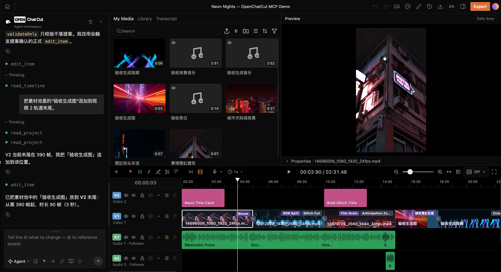
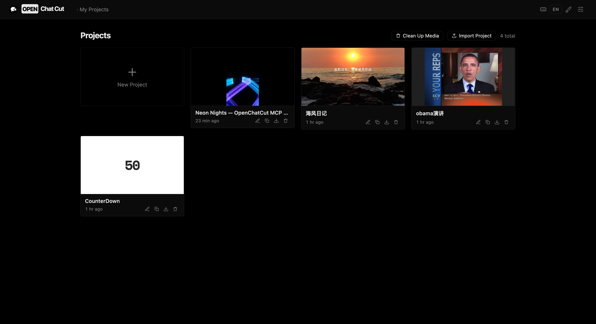
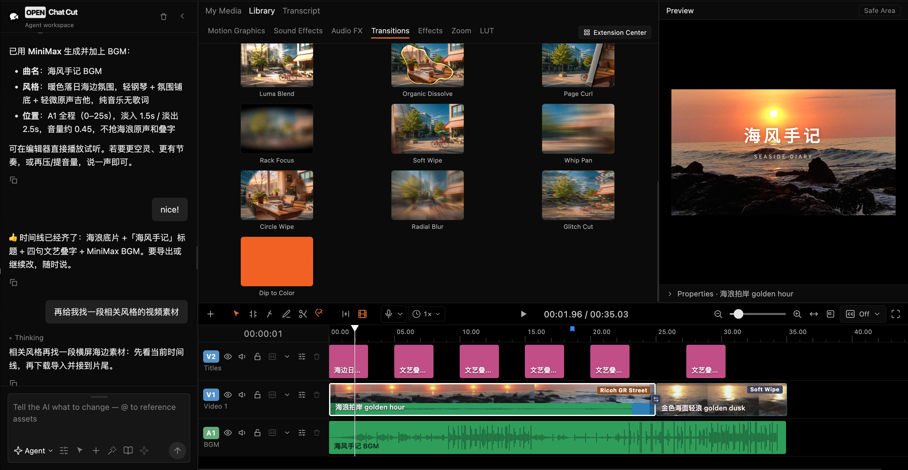
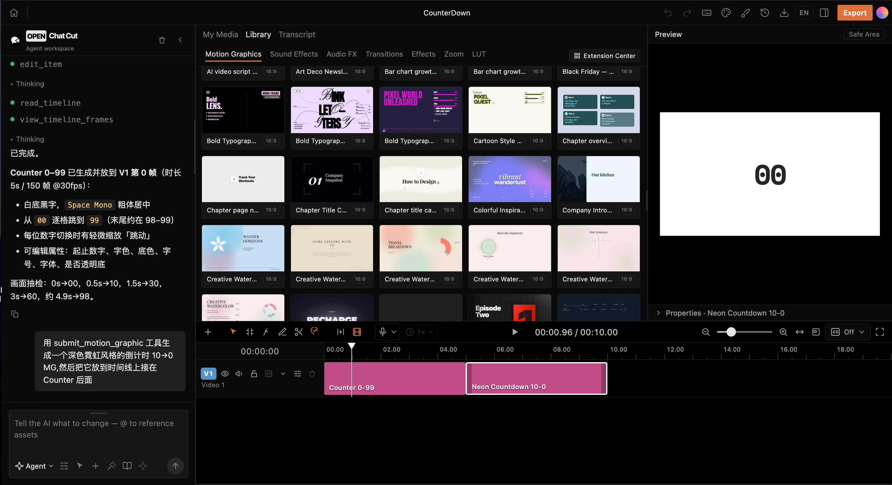
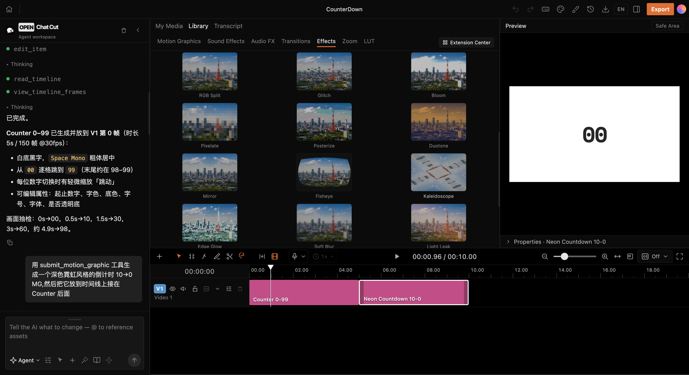
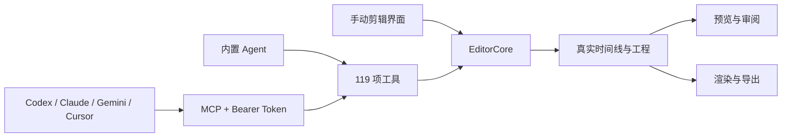

<p align="center">
  
</p>

<h1 align="center">YoloCut</h1>

<p align="center">
  <strong>可手动精剪，也可交给 Agent 的本地优先桌面视频编辑器</strong>
</p>

<p align="center">
  时间线剪辑 · 可拆分 Agent 工作台 · 批量自动剪辑 · 119 项 MCP 工具 · 本地模型 · NVDEC / NVENC
</p>

<p align="center">
  <strong>简体中文</strong> · <a href="README.md">English</a>
</p>

<p align="center">
  <a href="https://github.com/Hhz0823/YoloCut/releases/tag/v0.0.1"></a>
  
  
  
  <a href="LICENSE"></a>
</p>

<p align="center">
  <a href="https://github.com/Hhz0823/YoloCut/releases/download/v0.0.1/YoloCut-v0.0.1-x64.exe"><strong>下载 Windows 版</strong></a>
  · <a href="#agent-连接与完整剪辑流程">连接 Agent</a>
  · <a href="#从源码运行">从源码运行</a>
  · <a href="https://github.com/Hhz0823/YoloCut/issues">反馈问题</a>
</p>

<p align="center">
  
</p>

## YoloCut 是什么

YoloCut 把熟悉的桌面剪辑工作区与 Agent 自动化放进同一个真实工程。你可以在多轨时间线上手动裁剪、切分、调色、加字幕和混音，也可以让内置 Agent、Codex、Claude Code、Gemini CLI、Cursor 或其他 MCP 客户端读取工程并调用同一套编辑工具。

它不是“一句话生成一段不可修改的视频”。Agent 的操作最终都会落到轨道、片段、关键帧、字幕、转场、特效和素材上，能够预览、审阅、撤销、继续手动调整，并导出为可交付成片或工程文件。

```text
素材与脚本 → Agent 生成可审阅方案 → 写入真实时间线
           → 预览 / 调整 / 撤销 → 字幕与混音 → 硬件加速导出
```

## 产品界面

<table>
  <tr>
    <td width="50%">
      
      <br /><sub><b>本地工程首页</b> — 新建、搜索、导入、复制、归档和管理工程。</sub>
    </td>
    <td width="50%">
      
      <br /><sub><b>Agent 与时间线协作</b> — 对话生成方案，继续在真实轨道上精调。</sub>
    </td>
  </tr>
  <tr>
    <td width="50%">
      
      <br /><sub><b>动态图形</b> — 内置模板、自定义代码与可继续编辑的 MG 片段。</sub>
    </td>
    <td width="50%">
      
      <br /><sub><b>视觉特效</b> — WebGL / GLSL 特效、蒙版、调色、LUT 与转场。</sub>
    </td>
  </tr>
</table>

界面采用暗色液态玻璃视觉语言。Agent 工作台可以停靠左侧或右侧，也可以通过拖拽或按钮拆成独立窗口，再拖回主编辑器。

## 核心能力

| 领域 | YoloCut 当前能力 |
|---|---|
| 时间线 | 多轨、移动、裁剪、切分、波纹编辑、吸附、关键帧、标记、撤销与重做 |
| 画布与预览 | 25%–400% 缩放、抓手平移、自定义尺寸、安全区与社交平台构图参考线 |
| 视觉 | 液态玻璃、VHS、老电影、热成像、夜视、漫画、棱镜、波纹、CRT、绿幕、局部马赛克、LUT 和自定义 shader |
| 音频 | 多音轨、音效、背景音乐、旁白、响度、自动闪避、人声隔离和音频导出 |
| 文字稿与字幕 | 转写任务、词级编辑、停顿压缩、查找、自动字幕、翻译、样式与 SRT 导出 |
| Motion Graphics | 内置模板、受限运行沙箱、自定义模板和可视频化动态图形 |
| Agent | 内置对话 Agent、技能系统、提案式编辑、审批、进度、历史和外部 MCP |
| 批量自动剪辑 | 素材目录、剪辑脚本、口播脚本、参考成片、任务队列、逐条工程、质检与回写 |
| AI 能力 | 第三方 LLM、ZCode Antigravity、本地参考分析、本地/云端语音、图片、视频、音乐和音效服务 |
| 导出 | MP4、音频、字幕、FCPXML、工程包、导出历史、硬件感知 H.264 和资源感知排队 |

## Agent 工作台

Agent 工作台不是一个只能聊天的侧栏，而是 YoloCut 的剪辑控制面：

- 与手动时间线共享同一套 `EditorCore` 命令和工程状态。
- 支持拖出为独立宽窗口，并重新停靠到主界面左右两侧。
- 编辑先进入可审阅会话，可应用、拒绝、撤销或继续修改。
- 内置 Agent 与外部 MCP 客户端共享当前 **119 项核心工具**。
- 工程未打开时只提供受限 `server-direct` 数据层，不伪装成完整剪辑能力。



## Agent 连接与完整剪辑流程

安装 YoloCut Agent Skill：

```bash
npx skills add Hhz0823/YoloCut --skill yolocut
```

启动 YoloCut、打开目标工程，再从 **Agent 连接中心 (MCP)** 复制实际 URL 和 Bearer Token。默认端点为：

```text
http://localhost:5199/api/external-mcp/mcp
```

端口被占用时桌面端会自动换用其他回环端口，因此外部 Agent 应使用连接中心显示的实际地址，不要永久写死 `5199`。

完整会话顺序：

```text
yolocut_status
  → get_connection_manifest
  → list_projects
  → target_project
  → load_skill / ToolSearch
  → begin_edit_session
  → 读取与剪辑工具（携带 editSessionId）
  → review_edit_session
  → get_edit_session（status=applied）
```

只有 `readiness.fullEditing=ready`、`capabilityCoverage.complete=true` 且最终会话为 `applied`，Agent 才能报告剪辑完成。Codex、Claude Code、Gemini CLI 和 Cursor 的配置示例见 [YoloCut Agent 接入文档](YOLOCUT_AGENT_CONNECTION.md)。

## ZCode Antigravity 与第三方 AI

Windows 版可以自动发现本机 ZCode Antigravity：

- 仅接受 `127.0.0.1:18080..18180/v1`，防止本地 Key 被发送到远程中继。
- 实时请求 `/v1/models` 并要求存在 `gemini-3.7-flash`，不会用过期缓存伪装连接成功。
- YoloCut 只保存本地网关所需的随机 API Key，不读取 ZCode 的 OAuth 或上游账号凭据。
- 自动发现失败时保留手动填写本地端口、API Key 和模型的恢复入口。

内置 Agent 还可以配置 Anthropic、OpenAI、Gemini、Kimi、Qwen、GLM、DeepSeek、MiniMax、Mistral 以及 OpenAI-compatible 接口。具体能力取决于用户实际配置的供应商、模型和密钥；未配置的云端功能不会影响本地时间线编辑。

## 批量自动剪辑

YoloCut 的批量入口可以把素材、剪辑脚本、口播脚本和参考成片一起交给 Agent。队列契约最多接受 **10,000 条任务**，每条任务都拥有独立工程和状态，不把几千条视频挤进同一时间线。

1. 选择本地素材目录并授予一次性目录访问。
2. 指定剪辑脚本、口播脚本和可选参考成片。
3. 本地参考分析提取节奏、镜头结构、字幕、转场和调色规律。
4. Agent 按硬件允许的并发领取任务，生成可审阅方案。
5. 每条任务独立剪辑、质检、渲染并回写成功、失败或取消状态。

可选的开源参考分析包使用 Apache-2.0 的 `SmolVLM2-500M-Video-Instruct-GGUF` 与 `llama.cpp`。模型或运行时不可用时必须明确失败，不能伪造参考分析结果。参考成片只用于学习结构，不复制其人物、素材、商标或受版权保护的独特表达。

## 长 4K 视频与硬件自适应

YoloCut 会读取桌面硬件能力，为代理分析、预览代理、渲染和本地语音选择保守配置。长 4K 素材优先使用低分辨率代理进行分析和预览，最终导出仍读取原始媒体。

| 硬件档位 | 自动剪辑策略 | 本地口播建议 |
|---|---|---|
| 未识别 GPU / 低配设备 | 540p 代理，单路分析、单路渲染，硬件可用则使用，否则软件回退 | Kokoro CPU 回退 |
| RTX 2060 6 GB | 540p 代理，单路分析、单路渲染，NVDEC / NVENC 优先 | Kokoro 82M ONNX，WebGPU 优先、CPU 回退 |
| RTX 4060 8–9 GB | 720p 代理，2 路分析、1 路渲染 | Fish Audio S2 Pro `s2.cpp + Q6_K`（实验） |
| RTX 5060+ 8–9 GB | 1080p 代理，最多 3 路分析、1 路渲染 | Fish Audio S2 Pro `s2.cpp + Q6_K`（实验） |
| RTX 40/50 系且显存 ≥10 GB | 保护单路渲染与显存峰值 | Fish Audio S2 Pro `s2.cpp + Q8_0`（实验） |

在探测通过的 NVIDIA 环境中，预览代理支持 `NVDEC → scale_cuda → NVENC` 零拷贝路径；Windows H.264 还会依次探测 NVENC、QSV、AMF，失败后回退 `libx264`。界面与任务结果以运行时实际后端和回退原因作为事实，不根据显卡名称假装 CUDA 已启用。

> Fish S2 模型包使用 Fish Audio Research License，当前仅适合研究与非商业用途；商业使用需要另行获得书面许可。相关 `s2.cpp` 集成和硬件分档属于实验能力，实际速度与稳定性取决于驱动、显存和本机运行时。

## 下载与安装

当前公开桌面版本为 [YoloCut v0.0.1](https://github.com/Hhz0823/YoloCut/releases/tag/v0.0.1)，支持 Windows x64。

- 安装包：[YoloCut-v0.0.1-x64.exe](https://github.com/Hhz0823/YoloCut/releases/download/v0.0.1/YoloCut-v0.0.1-x64.exe)
- 大小：598,673,209 字节（570.9 MiB）
- SHA-256：`19AE22AB31D309C2D18DB706E7FD8BA06AD29F56530284DA987C5C475AC73841`
- 应用内更新：Release 同时包含 `latest-x64.yml` 和 `.blockmap`

安装包已经过静默安装、应用启动、渲染、MCP 恢复、更新源和卸载清理测试，但当前尚未进行 Authenticode 代码签名。Windows 可能显示 SmartScreen 提示，请在运行前核对 SHA-256。

v0.0.1 暂不提供 macOS 与 Linux 二进制安装包，这两个平台请从源码运行。

## 从源码运行

需要 Node.js `>=24 <25` 和 npm。

```bash
git clone https://github.com/Hhz0823/YoloCut.git
cd yolocut
npm install
cp .env.example .env.local
npm run dev
```

浏览器开发入口默认为：

```text
http://localhost:5199
```

桌面开发与 Windows 打包：

```bash
npm run desktop:dev
npm run desktop:dist:win
```

`.env.local` 只需配置实际使用的模型或素材服务。开发启动默认按 Git checkout/worktree 隔离工程、素材、任务、凭据和设置，避免多个开发分支互相污染。

## 数据、隐私与安全

- 工程、聊天、版本和媒体索引默认保存在本机 `~/.yolocut`；首次启动 YoloCut 时会自动挂载已有旧版数据根目录。
- 用户媒体保存在可配置的本地素材目录，可自行备份和迁移。
- AI 请求是否离开本机，取决于你选择的模型、生成或素材服务。
- 模型与供应商密钥由服务端保存，不通过 `VITE_` 暴露给浏览器。
- MCP 默认绑定回环地址；连接中心生成 Bearer Token，并提供真实连接自检。
- Agent 只能通过 `EditorCore` 命令修改工程，编辑保持可追踪、可审阅和可撤销。
- 模板、插件、shader、LLM 输出和用户输入在信任边界处校验。
- 本地目录授权使用不透明 grant，绝对路径不会跨越桌面 IPC 暴露给 Agent。

YoloCut 面向单机单用户桌面工作流，不应直接作为未经额外隔离的多租户服务部署。

## 技术架构

| 层 | 主要技术 |
|---|---|
| 桌面与前端 | Electron 43、React 19、TypeScript 6、Vite 8 |
| 编辑核心 | 不可变时间线状态、命令层、提案式应用与原子撤销 |
| Agent | Vercel AI SDK 7、Agent Skills、MCP SDK、119 项工具目录 |
| 预览与渲染 | Remotion Player、Remotion Renderer、FFmpeg |
| 视觉 | WebGL / GLSL、LUT、动态图形沙箱 |
| 本地推理 | ONNX Runtime、WebGPU、CUDA / DirectML / CoreML 策略、llama.cpp、s2.cpp |
| 持久化 | 本地工程库、SQLite、IndexedDB 缓存、可配置媒体目录 |
| 交付 | MP4、音频、SRT、FCPXML、工程导入导出 |

核心目录：

| 目录 | 职责 |
|---|---|
| `src/editor/` | 时间线状态与编辑命令 |
| `src/agent/` | Agent、工具、技能、审批和进度 |
| `src/components/chat/` | Agent 工作台、连接与批量入口 |
| `src/gl/` | WebGL 特效、转场和 shader runtime |
| `src/transcript/` / `src/captions/` | 转写、文字稿与字幕 |
| `src/persist/` | 工程、版本、媒体和批量任务持久化 |
| `server/plugins/` | 模型、生成、转写、导出和本地运行时 |
| `desktop/` | Electron 主进程、窗口、硬件探测与本机 IPC |
| `remotion/` | 无头渲染与交付导出 |

## 开发与验证

```bash
# 全量回归测试
npm test

# 类型检查与生产构建
npm run build

# 静态检查
npm run lint

# 批量自动剪辑契约
npm run verify:auto-edit

# 桌面更新与发布配置
npm run verify:desktop-update

# Agent 独立窗口拖出与停靠冒烟
npm run desktop:smoke:agent-window
```

涉及时间线、Agent、预览、导出或模型运行时的改动，应同时提交对应验证脚本，不能只依赖手工点击。

## 当前状态

YoloCut `0.0.1` 是早期公开版本，核心编辑、Agent、MCP、批量任务、Windows 打包和本地模型管理已进入可验证开发阶段，但仍有以下边界：

- Windows 安装包尚未代码签名。
- macOS 与 Linux 当前需要源码运行或自行打包。
- Fish S2、SmolVLM2 和部分 GPU 路径属于实验能力，必须以实际运行结果为准。
- RTX 2060/4060/5060 分档是经过契约测试的保守策略，不等于对所有驱动和整机配置的性能承诺。
- 工程格式与 Agent 工具仍会迭代，升级前建议备份重要工程。

版本变化见 [CHANGELOG.md](CHANGELOG.md)，发布文件见 [GitHub Releases](https://github.com/Hhz0823/YoloCut/releases)。

## 许可与来源说明

YoloCut 采用 [GNU Affero General Public License v3.0 或更高版本](LICENSE)。

YoloCut 是独立维护的开源项目，基于 AGPL 许可的 [0xsline/OpenChatCut](https://github.com/0xsline/OpenChatCut) 代码继续开发。该说明用于履行源码与许可证归属，不代表 YoloCut 继续使用上游产品品牌、社区入口或商业关系。

面向用户的产品名、应用名、客户端名、协议名和状态工具统一为 `YoloCut` / `yolocut` / `yolocut_status`。迁移模块仍能识别旧 `ChatCut` / `OpenChatCut` 数据目录与 MCP 状态别名，避免已有工程和 Agent 配置失效。

第三方依赖、模型、字体与内置二进制遵循各自许可证。Agent Skills 来源见 [`src/agent/skills/NOTICE.md`](src/agent/skills/NOTICE.md)，字体许可见 [`assets/fonts/LICENSES.md`](assets/fonts/LICENSES.md)。

## 参与开发

- 提交问题：[GitHub Issues](https://github.com/Hhz0823/YoloCut/issues)
- 查看版本：[GitHub Releases](https://github.com/Hhz0823/YoloCut/releases)
- 阅读变更：[CHANGELOG.md](CHANGELOG.md)
- Agent 接入：[YOLOCUT_AGENT_CONNECTION.md](YOLOCUT_AGENT_CONNECTION.md)

提交 PR 前请运行与改动范围匹配的验证，并说明操作系统、硬件、测试命令和已知限制。
