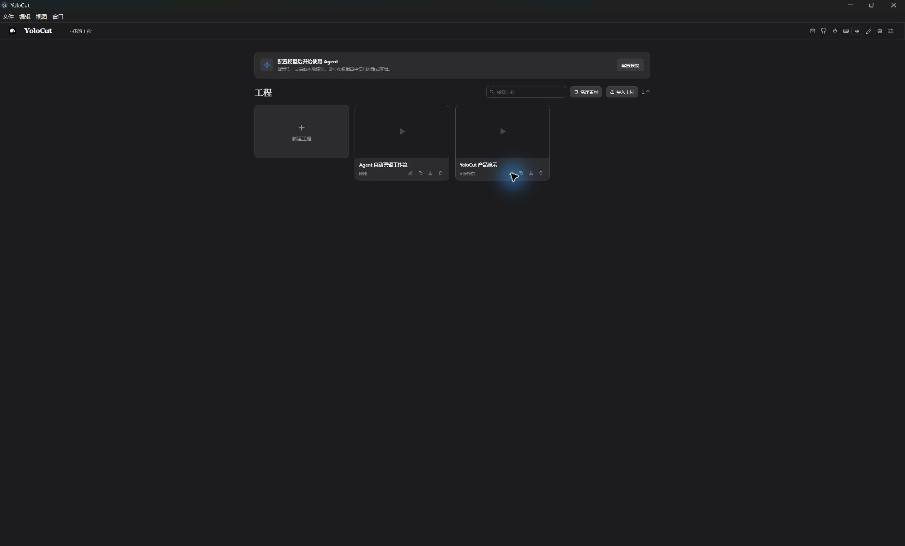
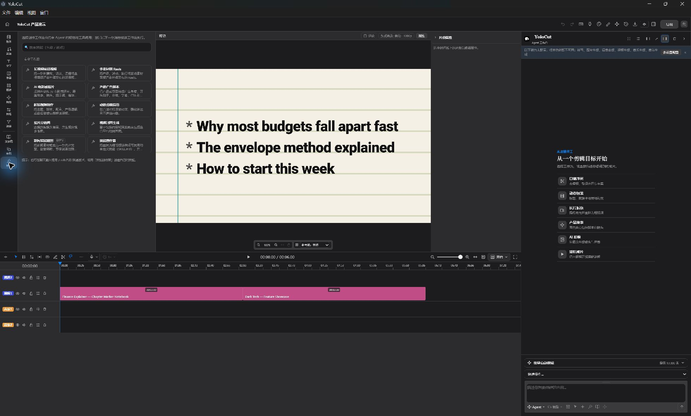
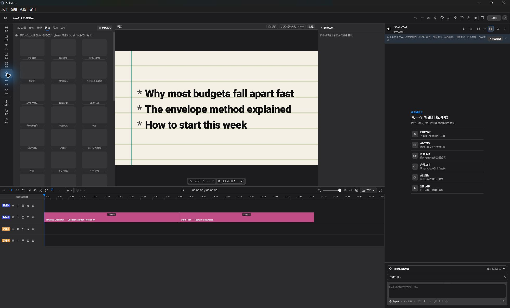
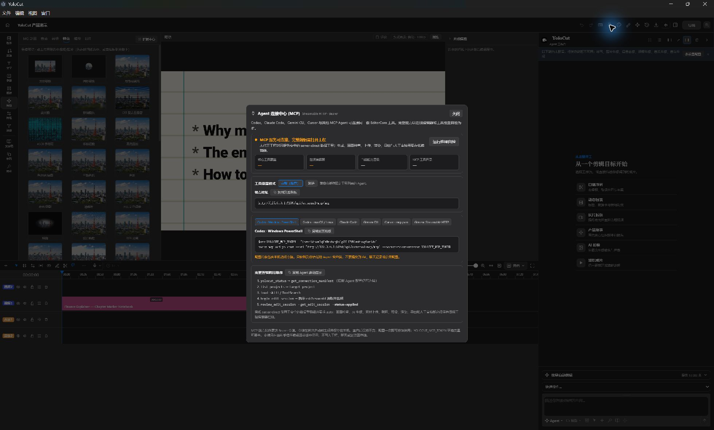

<p align="center">
  
</p>

<h1 align="center">YoloCut</h1>

<p align="center">
  <strong>自己精剪，也可交给 Agent；最终控制权始终留在时间线上。</strong>
</p>

<p align="center">
  开源桌面剪辑 · 可拆分 Agent 工作台 · 外部 MCP 接入 · 面向长 4K 素材的硬件自适应
</p>

<p align="center">
  <strong>简体中文</strong> · <a href="README.md">English</a>
</p>

<p align="center">
  <a href="https://github.com/Hhz0823/YoloCut/releases/tag/v0.0.2"></a>
  
  
  <a href="LICENSE"></a>
</p>

<p align="center">
  <a href="https://github.com/Hhz0823/YoloCut/releases/tag/v0.0.2"><strong>下载 v0.0.2</strong></a>
  · <a href="#连接外部-agent">连接 Agent</a>
  · <a href="#从源码运行">从源码运行</a>
  · <a href="https://github.com/Hhz0823/YoloCut/issues">反馈问题</a>
</p>

<p align="center">
  
</p>

## 一种新的剪辑方式

YoloCut 是本地优先的桌面视频编辑器，让人和 Agent 在**同一个真实工程**里协作。你可以在多轨时间线上手动裁剪、重排和精修，也可以让内置 Agent、Codex、Claude Code、Gemini CLI、Cursor 或其他 MCP 客户端调用同一套剪辑命令。

它不是“一句话生成一个不可修改结果”的黑盒。Agent 的工作会落到正常的素材、轨道、片段、字幕、转场、特效、关键帧和导出任务中。你可以预览方案、审阅修改、应用或拒绝、撤销，并继续手动编辑。

```text
素材 + 脚本 + 剪辑目标
        ↓
Agent 创建可审阅的编辑会话
        ↓
真实时间线修改 → 预览 → 精调 → 导出
```

## YoloCut 的核心差异

| 同一套编辑内核 | Agent 原生工作台 | 面向真实桌面硬件 |
|---|---|---|
| 手动界面与 Agent 工具最终汇入同一套 `EditorCore` 命令层。 | 工作台可停靠左右、拆成宽窗口，也可连接外部 MCP 客户端。 | 代理剪辑、解码回退、任务准入和 GPU 感知导出，让长视频与高分辨率工程更可用。 |

## 全新产品界面

<table>
  <tr>
    <td width="50%">
      
      <br /><sub><b>本地工程主页</b> — 新建、搜索、导入、复制、导出和管理工程。</sub>
    </td>
    <td width="50%">
      
      <br /><sub><b>Agent 工作台</b> — 可复用剪辑工作流与真实多轨工程并排协作。</sub>
    </td>
  </tr>
  <tr>
    <td width="50%">
      
      <br /><sub><b>特效库</b> — 蒙版、抠像、调色、LUT、Shader、转场与动态图形。</sub>
    </td>
    <td width="50%">
      
      <br /><sub><b>外部 Agent 接入</b> — 实时端点、Bearer Token、健康检查和完整编辑会话流程。</sub>
    </td>
  </tr>
</table>

以上截图均直接拍摄自当前 YoloCut `v0.0.2` 桌面程序，不再沿用旧项目界面素材。

## v0.0.2 当前能力

| 领域 | 当前能力 |
|---|---|
| 时间线 | 多轨视频与音频、移动、裁剪、切分、波纹修剪、滑移、比率拉伸、吸附、标记、关键帧、撤销与重做 |
| 预览与画布 | 25%–400% 缩放、抓手平移、自定义输出尺寸、安全区、构图参考线和片段变换 |
| 文字稿与字幕 | 转写任务、文字稿编辑、停顿清理、自动字幕、翻译、样式与 SRT 导出 |
| 音频 | 旁白录制、多轨混音、音效、音乐分析、响度、自动闪避与人声隔离 |
| 视觉 | 蒙版、绿幕、调色、示波器、LUT、WebGL/GLSL 特效、转场与动态图形模板 |
| Agent | 内置对话 Agent、技能、提案、审批策略、进度、历史和统一的 119 项工具目录 |
| 批量剪辑 | 素材目录、剪辑脚本、口播脚本、参考成片、持久队列、逐条工程、质检和状态回读 |
| 本地与云端 AI | 本地 ASR/TTS/模型包，以及可配置的第三方 LLM、图片、视频、音乐和音效服务 |
| 交付 | MP4、音频、SRT、FCPXML、便携工程包、导出历史和硬件感知 H.264 路由 |

## Agent 原生架构

可拆分 Agent 工作台不是装饰性的聊天侧栏，而是 YoloCut 的剪辑控制面：

- 与手动界面共享工程状态和编辑命令。
- 可停靠左侧或右侧、拆成独立宽窗口，并通过四角停靠回主编辑器。
- 修改操作先进入编辑会话审阅，只有应用成功后才视为完成。
- 内置 Agent 与外部 MCP 客户端共享统一的 **119 项工具目录**。
- 未打开工程时只暴露较小的 `server-direct` 能力，并明确报告限制。

<p align="center">
  
</p>

## 连接外部 Agent

安装 YoloCut Agent Skill：

```bash
npx skills add Hhz0823/YoloCut --skill yolocut
```

启动 YoloCut 并打开目标工程，再打开 **Agent 连接中心 (MCP)**，复制实时 URL 和 Bearer Token。默认端点为：

```text
http://localhost:5199/api/external-mcp/mcp
```

如果 `5199` 被占用，桌面程序会选择其他回环端口。因此外部 Agent 应使用连接中心显示的实际地址，不要永久写死默认端口。

完整完成流程：

```text
yolocut_status → get_connection_manifest → list_projects → target_project
→ load_skill / ToolSearch → begin_edit_session → 剪辑工具
→ review_edit_session → get_edit_session（status=applied）
```

只有完整剪辑能力就绪、能力覆盖完整并且最终编辑会话状态为 `applied`，Agent 才能报告剪辑完成。Codex、Claude Code、Gemini CLI、Cursor 和通用 Streamable HTTP 客户端配置见 [YOLOCUT_AGENT_CONNECTION.md](YOLOCUT_AGENT_CONNECTION.md)。

## 批量自动剪辑

可以把素材目录、剪辑脚本、口播脚本和可选参考成片一起交给 YoloCut。持久队列最多接受 **10,000 条任务**，每个输出拥有独立工程和生命周期，不把几千条视频堆到同一条时间线。

1. 扫描已经授权的本地素材目录。
2. 附加剪辑脚本、口播脚本和可选参考成片。
3. 分析节奏、镜头结构、字幕、转场和色彩意图。
4. Agent 按硬件允许的并发创建可审阅剪辑。
5. 每条任务独立渲染、质检，并回读成功、失败或取消状态。

可选的本地参考分析使用 Apache-2.0 的 `SmolVLM2-500M-Video-Instruct-GGUF` 模型包与 `llama.cpp`。模型或运行时缺失时会明确失败，不会伪造分析结果。

## 低配电脑上的长 4K 工程

YoloCut 把交互代理链路与最终质量链路分开：分析和预览可以使用更小的衍生代理，最终导出仍读取原始素材。

- NVIDIA 环境通过实际探测后优先使用 `NVDEC → scale_cuda → NVENC`。
- H.264 路由依次探测 NVENC、Intel QSV、AMD AMF，最后回退软件 `libx264`。
- AV1、VP9 或硬件不支持的路径可回退到 `libaom-av1`、`libvpx` 等 FFmpeg 软件解码器。
- CPU、内存、显存、编码能力和当前负载共同决定代理尺寸与队列并发。
- 运行结果展示实际使用的后端和回退原因，不会只根据显卡或模型名称假装 GPU 已启用。

| 硬件档位 | 保守剪辑策略 | 本地口播建议 |
|---|---|---|
| 未识别 GPU / 低配电脑 | 540p 代理，单路分析、单路渲染 | Kokoro CPU 回退 |
| RTX 2060 6 GB | 540p 代理，探测通过后启用 NVDEC/NVENC | Kokoro 82M ONNX，优先 WebGPU、可回退 CPU |
| RTX 4060 8–9 GB | 720p 代理，最多两路分析，保护单路渲染 | Fish Audio S2 Pro `s2.cpp + Q6_K`（实验） |
| RTX 5060+ 8–9 GB | 1080p 代理，最多三路分析，保护单路渲染 | Fish Audio S2 Pro `s2.cpp + Q6_K`（实验） |
| RTX 40/50 系且显存至少 10 GB | 提高本地推理质量，同时为渲染保留显存 | Fish Audio S2 Pro `s2.cpp + Q8_0`（实验） |

> Fish S2 模型权重采用 Fish Audio Research License，商业使用需要另行获得书面许可。硬件分档是保守策略契约，不是对所有驱动和整机配置的性能承诺。

## 下载

| 平台 | v0.0.2 安装包 |
|---|---|
| Windows x64 | [YoloCut-v0.0.2-x64.exe](https://github.com/Hhz0823/YoloCut/releases/download/v0.0.2/YoloCut-v0.0.2-x64.exe) |
| macOS Apple Silicon | [YoloCut-v0.0.2-arm64.dmg](https://github.com/Hhz0823/YoloCut/releases/download/v0.0.2/YoloCut-v0.0.2-arm64.dmg) |
| macOS Intel | [YoloCut-v0.0.2-x64.dmg](https://github.com/Hhz0823/YoloCut/releases/download/v0.0.2/YoloCut-v0.0.2-x64.dmg) |
| Linux x64 | [YoloCut-v0.0.2-x86_64.AppImage](https://github.com/Hhz0823/YoloCut/releases/download/v0.0.2/YoloCut-v0.0.2-x86_64.AppImage) |
| 校验文件 | [SHA256SUMS.txt](https://github.com/Hhz0823/YoloCut/releases/download/v0.0.2/SHA256SUMS.txt) |

Windows 安装包当前未签名；macOS 使用临时签名但尚未公证；Linux AppImage 也未签名。运行前请使用 Release 中提供的 SHA-256 校验安装包。

## 从源码运行

需要 Node.js `>=24 <25` 和 npm。

```bash
git clone https://github.com/Hhz0823/YoloCut.git
cd YoloCut
npm install
cp .env.example .env.local
npm run dev
```

桌面开发与 Windows 打包：

```bash
npm run desktop:dev
npm run desktop:dist:win
```

开发配置会按 Git checkout/worktree 隔离工程、素材、凭据、任务和设置。只需配置自己实际要使用的 AI 或素材服务。

## 数据与安全

- 工程、对话、版本、索引和设置默认保存在本机 `~/.yolocut`。
- 迁移层可以挂载旧版数据根目录，避免用户丢失已有工程。
- 服务商密钥保存在服务端，不通过 `VITE_` 浏览器变量暴露。
- MCP 默认绑定回环地址，并要求使用程序生成的 Bearer Token。
- 目录访问使用不透明授权，绝对本地路径不会跨越桌面 IPC 暴露给 Agent 工具。
- 只有用户明确配置的供应商会产生外部 AI 网络请求。
- YoloCut 面向单机单用户桌面工作流，不应直接作为未隔离的多租户服务部署。

## 架构与验证

| 层 | 主要职责 |
|---|---|
| `src/editor/` | 不可变时间线状态与编辑命令 |
| `src/agent/` | Agent 运行时、工具、技能、提案、审批与进度 |
| `src/gl/` | WebGL 特效、转场与 Shader 运行时 |
| `src/transcript/`、`src/captions/` | ASR、文字稿编辑、字幕与翻译 |
| `src/persist/` | 工程、版本、媒体元数据与批量任务 |
| `server/` | 本地 HTTP、MCP、模型、媒体处理、任务与导出 |
| `desktop/` | Electron 窗口、硬件探测、安全存储与本机 IPC |
| `remotion/` | 无头渲染与交付导出 |

```bash
npm test                         # 全量回归测试
npm run build                    # 类型检查与生产构建
npm run lint                     # 静态检查
npm run verify:architecture      # 依赖边界
npm run verify:mcp               # Agent/MCP 契约
npm run verify:media-performance # 编解码、代理、加速与回退
npm run verify:auto-edit         # 批量自动剪辑契约
npm run desktop:smoke:agent-window
```

## 当前版本边界

YoloCut `0.0.2` 是早期公开版本。核心剪辑、Agent、MCP、批量任务、桌面打包和本地模型管理正在持续验证，但以下能力仍属于实验阶段：

- Fish S2、SmolVLM2 和部分 GPU 路径依赖本机运行时与驱动。
- 工程格式和 Agent 工具目录会继续演进，升级前请备份重要工程。
- 代码签名与公证尚未达到正式商业发布标准。
- 对应 AI 功能需要用户配置供应商或安装模型；未配置时仍可正常使用手动剪辑。

版本变化见 [CHANGELOG.md](CHANGELOG.md)，发布文件见 [GitHub Releases](https://github.com/Hhz0823/YoloCut/releases)。

## 许可、来源与参与开发

YoloCut 由 [hhz0823](https://github.com/Hhz0823) 独立维护，采用 [GNU Affero General Public License v3.0 或更高版本](LICENSE)。

代码基于 AGPL 许可的 [0xsline/OpenChatCut](https://github.com/0xsline/OpenChatCut) 项目继续开发。该说明用于保留源码和许可证来源；上游品牌、贡献者、社区入口与商业关系均不属于 YoloCut 产品及其公开发布历史。

第三方库、模型、字体、技能和内置二进制继续遵循各自许可证，详见 [THIRD_PARTY_NOTICES.md](THIRD_PARTY_NOTICES.md)、[`src/agent/skills/NOTICE.md`](src/agent/skills/NOTICE.md) 和 [`assets/fonts/LICENSES.md`](assets/fonts/LICENSES.md)。

- 问题反馈：[github.com/Hhz0823/YoloCut/issues](https://github.com/Hhz0823/YoloCut/issues)
- 发布版本：[github.com/Hhz0823/YoloCut/releases](https://github.com/Hhz0823/YoloCut/releases)
- Agent 接入：[YOLOCUT_AGENT_CONNECTION.md](YOLOCUT_AGENT_CONNECTION.md)
